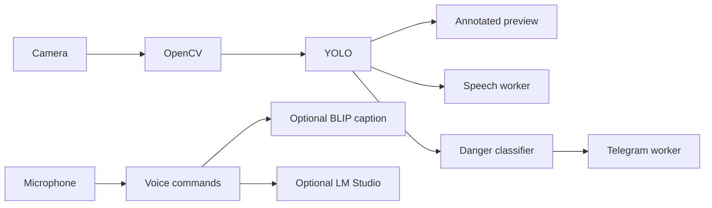

# Swanetra AI Assistant

Swanetra is a local assistive vision application for visually impaired users. It combines an OpenCV camera feed, YOLO object detection, optional BLIP scene captions, distance estimates, local speech feedback, conversational AI through LM Studio, and optional Telegram emergency alerts.

## Overview

The primary runtime is a Python desktop application. It opens the camera, draws an annotated **Swanetra Vision** window, announces important changes, and keeps optional network services isolated from the vision loop.

## Key Features

- Real-time YOLO detection with bounding boxes, class names, confidence, and optional distance.
- Camera fallback across indexes `0` and `1`, with macOS permission guidance.
- Optional BLIP scene captioning when the user asks what is visible.
- Non-blocking local TTS with announcement debouncing.
- Centralized danger classes and Telegram cooldown protection.
- Voice commands for scene descriptions, help alerts, and conversational questions.

## How It Works



## Architecture

Local mode is the supported implementation:

```text
Mac camera -> OpenCV -> YOLO -> overlay / speech / danger classification
									  -> optional Telegram alert
```

The camera loop remains local and continuous. TTS and Telegram requests run in worker threads so they do not pause frame capture.

## Tech Stack

Python, OpenCV, Ultralytics YOLO, PyTorch, Hugging Face Transformers/BLIP, SpeechRecognition, pyttsx3, Requests, and optional LM Studio.

## Project Structure

```text
main.py             Local application and runtime orchestration
config.py           Environment-based settings
tests/test_core.py  Camera-independent unit tests
test_telegram.py     Independent Telegram message test
test_system.py       Non-destructive local diagnostics
test_yolo.py        Simple standalone YOLO camera check
yolov8n.pt          Local YOLO model weights
.env.example        Safe configuration template
```

## Installation

```bash
python3 -m venv .venv
source .venv/bin/activate
pip install -r requirements.txt
```

The BLIP model downloads from Hugging Face the first time it is initialized. YOLO uses the included `yolov8n.pt` file.

## Environment Variables

Copy `.env.example` to `.env`. The application loads `.env` automatically using `python-dotenv`; no shell export is required.

Important settings include:

- `TELEGRAM_BOT_TOKEN` and `TELEGRAM_CHAT_ID` for optional alerts.
- `TELEGRAM_CHAT_ID` must identify the destination user, group, or channel. A bot username is not a destination chat ID; use the numeric ID returned by Telegram after the user starts the bot.
- `MIC_DEVICE_INDEX` optionally selects a microphone.
- `SWANETRA_CAMERA_INDEXES` for camera fallback order.
- `SWANETRA_YOLO_CONFIDENCE` for the display threshold.
- `SWANETRA_DANGER_CLASSES` for the comma-separated danger list.
- `SWANETRA_ALERT_COOLDOWN_SECONDS` to limit repeated alerts.
- `SWANETRA_API_URL` and `SWANETRA_AI_MODEL` for LM Studio.

Never commit `.env`. The checked-in `.env.example` contains placeholders only.

## Running Locally

```bash
.venv/bin/python main.py
```

The **Swanetra Vision** window opens automatically. Put an object or person in view to see its box, label, confidence, and estimated distance when configured. Press `Q` or `Esc` to exit.

## Camera Permissions on macOS

Open **System Settings -> Privacy & Security -> Camera** and allow the application that launched Python, such as Terminal or VS Code. If the camera cannot be opened, Swanetra tries indexes `0` and `1` and prints a clear permission message.

## YOLO Object Detection

The camera loop runs `yolov8n.pt` on each frame and renders a custom overlay. Green boxes indicate normal detections; configured danger classes use red boxes. Distance is an estimate based on the configured focal length and assumed object width, not a calibrated measurement.

## Voice Feedback

Speech runs in a background worker. Danger announcements are debounced and are not repeated every frame. Voice commands such as “what do you see” request a snapshot description, while “I need help” sends an emergency message when Telegram is configured.

Recognized emergency phrases include “I am in danger”, “help me”, “emergency”, “I need help”, and “call for help”. All of them use the same cooldown-protected emergency handler.

## Danger Detection

The default danger classes are `car`, `truck`, `bus`, `motorcycle`, and `bicycle`. Configure them through `SWANETRA_DANGER_CLASSES`. A danger detection triggers an urgent local announcement and a cooldown-protected Telegram message.

## Telegram Emergency Alerts

Telegram is optional. If credentials are missing, vision continues and the application prints that alerts are disabled. Alerts include object, confidence, estimated distance when available, and a timestamp. Requests run in a background worker and use `SWANETRA_ALERT_COOLDOWN_SECONDS` to prevent spam.

Test Telegram independently before starting the camera:

```bash
.venv/bin/python test_telegram.py
```

The command reports the safe Telegram API error without printing the token. A 401/403 generally means the token was revoked or invalid; a chat-not-found error means the destination ID is wrong or the bot has not been started or added to that chat.

Run local diagnostics:

```bash
.venv/bin/python main.py --diagnose
.venv/bin/python test_system.py
```

## Testing

```bash
.venv/bin/python -m pytest -q
.venv/bin/python -m py_compile main.py config.py
```

The unit tests do not require a physical camera, microphone, Telegram credentials, or network access.

## Troubleshooting

- **No window:** grant camera permission to Terminal/VS Code and run from an interactive macOS session.
- **No detections:** improve lighting, move closer, or lower `SWANETRA_YOLO_CONFIDENCE`.
- **Slow captions:** BLIP is optional and can take several seconds on CPU/MPS; YOLO detection remains available.
- **No speech:** grant microphone access and check the local macOS speech driver.
- **Telegram disabled:** set both Telegram environment variables; do not put them in source code.
- **Telegram 401/403:** revoke the exposed token with BotFather, create a replacement, start the bot, obtain the numeric destination chat ID, and update `.env`.
- **LM Studio unavailable:** conversational commands return a fallback while local vision continues.

## Deployment and Vercel Architecture

Vercel cannot access a user's local Mac camera or host an infinite OpenCV loop. Keep the local Python application as the vision runtime. A future Vercel deployment should be a separate browser/API dashboard:

```text
Browser camera -> web frontend -> API/backend -> detection service/dashboard
Mac camera     -> local Python runtime -> OpenCV/YOLO/speech/alerts
```

Do not move the local camera loop into a Vercel Function.

## Security

Telegram credentials must be environment variables. A real Telegram token was present in the repository history before this cleanup. Revoke it through BotFather and create a replacement token; removing it from the latest files does not remove it from git history. Never paste replacement credentials into source files or logs.

The current local token was also exposed during debugging and should be revoked immediately. The repository never needs the token in `config.py`, logs, tests, or documentation.

## Future Improvements

- Calibrated per-class distance profiles.
- Optional Telegram danger snapshots.
- A separate web dashboard backed by a persistent detection API.
- More comprehensive integration tests with mocked camera frames.

## Contributing

Keep local camera behavior working, add tests for pure logic, and avoid committing secrets or generated files.

## License

No license has been declared yet. Add a license before distributing the project publicly.
